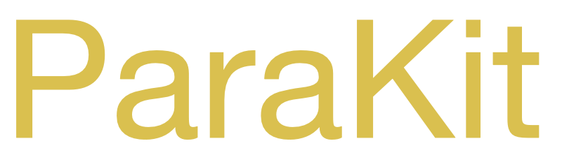

<p align="center">

</p>

# ParaKit
ParaKit is a Python toolkit for training <u>P</u>robability and <u>A</u>daptation <u>R</u>ate <u>A</u>djustment (PARA) parameters used to define context model initializations for the AV2 video coding standard, currently under development by the Alliance for Open Media (AOM).

ParaKit is named after Apple's CWG-D115 proposal to the AOM's Coding Working Group, entitled "<u>PARA</u>: Probability Adaptation Rate Adjustment for Entropy Coding", where the "<u>Kit</u>" comes from the word toolkit, often referring to a collection of software tools.

---

## 1. Requirements
ParaKit is built on top of the AV2 reference software (AVM), so the  requirements include:

- For the compilation of AVM software, it is recommended to install a recent version of `cmake` (e.g., version 3.29 and after).
- For setting up necessary Python packages, it is required to install `Homebrew` (e.g., version 4.3.3 and after).

ParaKit's training is data-driven, so it requires collecting data from AVM coded bitstreams. For this purpose, a separate branch (`research-v8.0.0-parakit`) in AVM is created as a reference implementation that allows developers to collect data for a selection of contexts.
[Section 5](#5-data-collection-guidelines-for-modifying-avm) below provides some instructions on how to modify the ParaKit-AVM codebase to collect data for the context(s) of interest.

After making necessary modifications to the AVM for data collection, ParaKit has the following two requirements to be able to run training:

1. a binary `aomdec`*, compiled from a version of AVM for data collection, and
2. compatible AVM bitstreams, from which the data will be collected using `aomdec`.

*Note: `aomdec` needs to be compiled on the same platform that the developer will run ParaKit.

---

## 2. Installation
<b>Step 1:</b> clone AVM, change directory and switch to `research-v8.0.0-parakit` branch.
```
git clone <repository URL> ParaKit-AVM
cd ParaKit-AVM
git checkout research-v8.0.0-parakit
```

<b>Step 2:</b> change directory to `ParaKit` and run the setup.sh script, which creates a python virtual environment `venv` and installs necessary python packages within `venv`.
```
cd ParaKit
source setup.sh
```

<b>Step 3:</b> compile the AVM decoder by running the following command which will build `aomdec` under ./binaries directory.
```
source setup_decoder.sh
```
Note that `setup_decoder.sh` script is provided for convenience. The user can always copy a valid `aomdec` binary compiled from the modified AVM codebase (e.g., `research-v8.0.0-parakit` branch ).

Also, make sure that `aomdec` binary under `binaries/` is executable, if not, run the following command.
```
sudo chmod +x ./binaries/aomdec
```
<b>Important note:</b> The sample AVM implementation in `research-v8.0.0-parakit` branch can collect data only for `eob_flag_cdf16` and `eob_flag_cdf32` contexts. To support other contexts, the developer needs to replace the binary compiled with the necessary changes to AVM. Please refer to [Section 5](#5-data-collection-guidelines-for-modifying-avm) for more details on modifying the AVM codebase.

<b>Installation complete:</b> After the steps above, we are ready to use ParaKit and train for `eob_flag_cdf16` and `eob_flag_cdf32` contexts. You may now run the unit test as the next step.

<b>Unit test (optional, but recommended):</b> run the following unit test script to further check if the installation is complete without any issues.
```
python run_unit_test.py
```
The unit test uses the two sample bitstreams under `unit_test/bitstreams` compatible with `research-v8.0.0-parakit`, as discussed in [Section 1](#1-requirements).

## 3. Usage: running training via ParaKit
<b>Step 1:</b> replace `aomdec` under `binaries/` with a new decoder binary (based on to collect data for desired contexts). The `setup_decoder.sh` script can be used to compile new binaries from modified AVM. Make sure that `aomdec` is executable (see Step 3 in [Section 2](#2-installation)).

<b>Step 2:</b> copy compatible AVM bitstreams under `bitstreams/` directory. The only requirement is that each bitstream's filename should start with `Bin_`.

<b>Step 3:</b> check and modify `parameters.yaml` file to set necessary user defined configurations. See [Section 4](#4-details-of-configuring-parametersyaml) for more details.

<b>Step 4:</b> run the `run.py` python script.
```
python run.py
```
This step will run the whole training pipeline that:

1. collects the data in csv format by decoding all the bitstreams in the `bitstreams/` directory. The csv files will be generated under `results/data/` directory,
2. runs the training for each csv data under `results/data/` and generates a result report file in json format,
3. collects and combines the results in json files, and
4. generates the context initialization tables in a single `Context-Table_*.h` file under `results/`.

<b>Step 5:</b> use the generated tables from the `Context-Table_*.h` file under `results/` by copying them into the AVM codebase for testing.

---

## 4. Details of configuring parameters.yaml
ParaKit requires the `parameters.yaml` file present in the main directory.
The sample `./parameters.yaml` provided in the repository is configured to train for `eob_flag_cdf16` and `eob_flag_cdf32` contexts as follows:
```
TEST_OUTPUT_TAG: "Test-Tag"
BITSTREAM_EXTENSION: "av1"
DESIRED_CTX_LIST:
 - eob_flag_cdf16
 - eob_flag_cdf32
eob_flag_cdf16: "av1_default_eob_multi16_cdfs"
eob_flag_cdf32: "av1_default_eob_multi32_cdfs"
```
where the mandatory fields are:

- `TEST_OUTPUT_TAG` is the tag used to identify a test (this tag appears in the resulting generated context table `results/Context-Table_*.h`),
- `BITSTREAM_EXTENSION` specifies the extension of bitstreams copied under `bitstreams/`,
- `DESIRED_CTX_LIST` specifies the context(s) to be trained,
- `eob_flag_cdf16: "av1_default_eob_multi16_cdfs"` and `eob_flag_cdf32: "av1_default_eob_multi32_cdfs"` define the context name to context table mapping.

<b>Important note:</b> The developer needs to make sure that the context names (e.g., `eob_flag_cdf16` or `eob_flag_cdf32`) follow the same convention in the ParaKit's AVM decoder (`aomdec`).
The csv data files obtained from `aomdec` are in `Stat_context_name_*.csv` format, where in the above example, `context_name` is replaced by `eob_flag_cdf16` or `eob_flag_cdf32`.

---

## 5. Data collection: guidelines for modifying AVM
The data collection requires some modifications to AVM decoder implementation. For this purpose, `research-v8.0.0-parakit` branch is created as a reference implementation based on AVM.

In the `research-v8.0.0-parakit` branch, the basic data collection module is implemented in `aom_read_symbol_probdata` function by extending the existing `aom_read_symbol` function in AVM. All the changes related to data collection are implemented under the `CONFIG_PARAKIT_COLLECT_DATA` macro. The comments including `@ParaKit` text provides additional information to guide developers on how to extend data collection for different contexts.

The `research-v8.0.0-parakit` branch implements the necessary changes on top `research-v8.0.0` tag to collect data specifically for `eob_flag_cdf16` and `eob_flag_cdf32` context groups.
Developers can extend this to add support for new (or any other) contexts on by following the changes under `CONFIG_PARAKIT_COLLECT_DATA` macro and instructions in the comments by searching the text `@ParaKit` on their local AVM version.

---

## Contact
Please contact Hilmi Egilmez for any questions regarding the use of ParaKit.

E-mail: h_egilmez@apple.com

---
